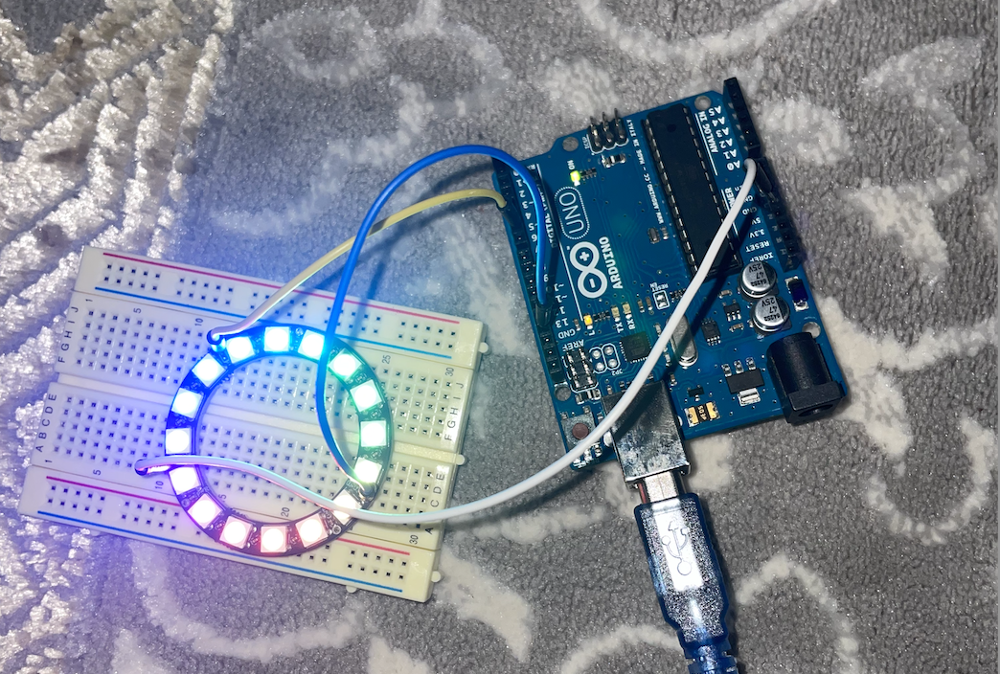
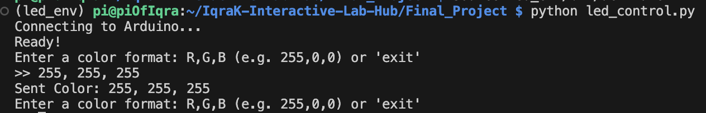

1st step: Test LED ring in arduino 
Connect led ring to arduino using these pins
Power= 5V
GND = GND
Digital In = Pin 6 in arduino UNO
Download library Adafruit Neopixel in Arduino IDE
Load  led_test.ino sketch on arduino.

LED works

2nd Step: Serial communication between arduino and raspberry pi 
Connect the arduino to pi using usb cable
run led_control.py on pi.

3rd Step: Adding sensors to control lights

First just used potentiometer to control brightness
Used imu to control lightchange 
Used mic for 2 things ( lumos maxima, nox , 2. Change lights based on sound)

sudo apt-get install -y libportaudio2 portaudio19-dev flac i2c-tools python3-dev

**Summary of what fixed your errors:**
* **`portaudio19-dev`**: Fixed the `AttributeError: Could not find PyAudio` crash.
* **`flac`**: Fixed the `OSError: FLAC conversion utility not available` crash.
* **`python3-dev`**: Ensures headers are available for compiling complex libraries like `spidev`.

Libraries for pi
# Enable I2C interface on the Pi (if you haven't already)
sudo raspi-config nonint do_i2c 0

# Install the SparkFun Qwiic package (covers almost all Qwiic boards)
pip install sparkfun-qwiic

# Install Audio libraries
pip install sounddevice numpy

{{WANT TO AADD CAPACITIVE SENCORS to make colors that i want.}}