# Ph-UI!!!

<details>
	<summary><strong>Instructions for Students (Click to Expand)</strong></summary>
  
	**Submission Cleanup Reminder:**
	- This README.md contains extra instructional text for guidance.
	- Before submitting, remove all instructional text and example prompts from this file.
	- You may delete these sections or use the toggle/hide feature in VS Code to collapse them for a cleaner look.
	- Your final submission should be neat, focused on your own work, and easy to read for grading.
  
	This helps ensure your README.md is clear, professional, and uniquely yours!
</details>

---

## Lab 4 Deliverables

### Part 1 (Week 1)
**Submit the following for Part 1:**  
*️⃣ **A. Capacitive Sensing**
	- Photos/videos of your Twizzler (or other object) capacitive sensor setup
	- Code and terminal output showing touch detection

*️⃣ **B. More Sensors**
	- Photos/videos of each sensor tested (light/proximity, rotary encoder, joystick, distance sensor)
	- Code and terminal output for each sensor

*️⃣ **C. Physical Sensing Design**
	- 5 sketches of different ways to use your chosen sensor
	- Written reflection: questions raised, what to prototype
	- Pick one design to prototype and explain why

*️⃣ **D. Display & Housing**
	- 5 sketches for display/button/knob positioning
	- Written reflection: questions raised, what to prototype
	- Pick one display design to integrate
	- Rationale for design
	- Photos/videos of your cardboard prototype

---

### Part 2 (Week 2)
**Submit the following for Part 2:**  
*️⃣ **E. Multi-Device Demo**
	- Code and video for your multi-input multi-output demo (e.g., chaining Qwiic buttons, servo, GPIO expander, etc.)
	- Reflection on interaction effects and chaining

*️⃣ **F. Final Documentation**
	- Photos/videos of your final prototype
	- Written summary: what it looks like, works like, acts like
	- Reflection on what you learned and next steps

---

## Lab Overview

## Part 1 Lab Preparation

### Gathering materials for this lab:

* Cardboard (start collecting those shipping boxes!)
* Found objects and materials--like bananas and twigs.
* Cutting board
* Cutting tools
* Markers

## Deliverables \& Submission for Lab 4

The deliverables for this lab are, writings, sketches, photos, and videos that show what your prototype:
* "Looks like": shows how the device should look, feel, sit, weigh, etc.
* "Works like": shows what the device can do.
* "Acts like": shows how a person would interact with the device.

For submission, the readme.md page for this lab should be edited to include the work you have done:
* Upload any materials that explain what you did, into your lab 4 repository, and link them in your lab 4 readme.md.
* Link your Lab 4 readme.md in your main Interactive-Lab-Hub readme.md. 
* Labs are due on Mondays, make sure to submit your Lab 4 readme.md to Canvas.


## Lab Overview

A) [Capacitive Sensing](#part-a)

B) [OLED screen](#part-b) 

C) [Paper Display](#part-c)

D) [Materiality](#part-d)

E) [Servo Control](#part-e)

F) [Record the interaction](#part-f)


3. Check CircuitPython Blinka installation:**
	```bash
	python blinkatest.py
	```
	If you see "Hello blinka!", your setup is correct. If not, follow the troubleshooting steps in the file or ask for help.


### Part A
### Capacitive Sensing, a.k.a. Human-Twizzler Interaction 

<p float="left">

 
</p>

Plug in the capacitive sensor board with the QWIIC connector. Connect your Twizzlers with either the copper tape or the alligator clips (the clips work better). Install the latest requirements from your working virtual environment:

These Twizzlers are connected to pads 6 and 10. When you run the code and touch a Twizzler, the terminal will print out the following

```
(circuitpython) pi@ixe00:~/Interactive-Lab-Hub/Lab 4 $ python cap_test.py 
Twizzler 10 touched!
Twizzler 6 touched!
```


### Part B
### More sensors

#### Light/Proximity/Gesture sensor (APDS-9960)
It is capable of sensing proximity, light (also RGB), and gesture! 
 

 


#### Rotary Encoder 

A rotary encoder is an electro-mechanical device that converts the angular position to analog or digital output signals. 

```
(circuitpython) pi@ixe00:~/Interactive-Lab-Hub/Lab 4 $ python encoder_test.py
```


#### Joystick 


A [joystick](https://www.sparkfun.com/products/15168) can be used to sense and report the input of the stick for it pivoting angle or direction. It also comes with a button input!

<p float="left">

</p>


#### Distance Sensor


Earlier we have asked you to play with the proximity sensor, which is able to sense objects within a short distance. Here, we offer [Sparkfun Proximity Sensor Breakout](https://www.sparkfun.com/products/15177), With the ability to detect objects up to 20cm away.

<p float="left">


### Part C
### Physical considerations for sensing

Usually, sensors need to be positioned in specific locations or orientations to make them useful for their application. Now that you've tried a bunch of the sensors, pick one that you would like to use, and an application where you use the output of that sensor for an interaction. For example, you can use a distance sensor to measure someone's height if you position it overhead and get them to stand under it.


**\*\*\*Draw 5 sketches of different ways you might use your sensor, and how the larger device needs to be shaped in order to make the sensor useful.\*\*\***

My 5 ideas are listed below:

1. Snake Game :This is a handheld gaming console where a joystick controls the snake's direction during gameplay, and a rotary encoder is used to navigate and select options in the game's menus.
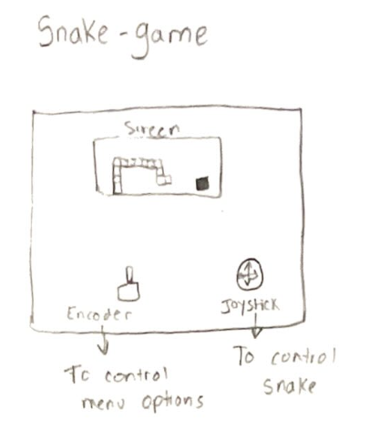
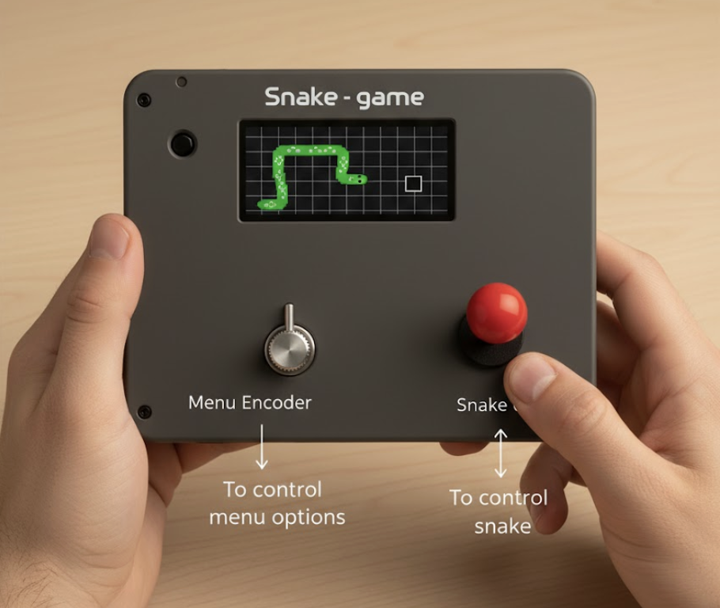

2. Music Player: This device uses a gesture sensor to allow the user to control playback (like skipping a song with a swipe motion), while a proximity sensor could be used to control the volume based on how far or close you are.
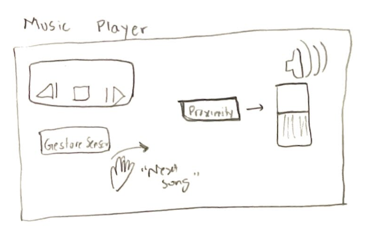
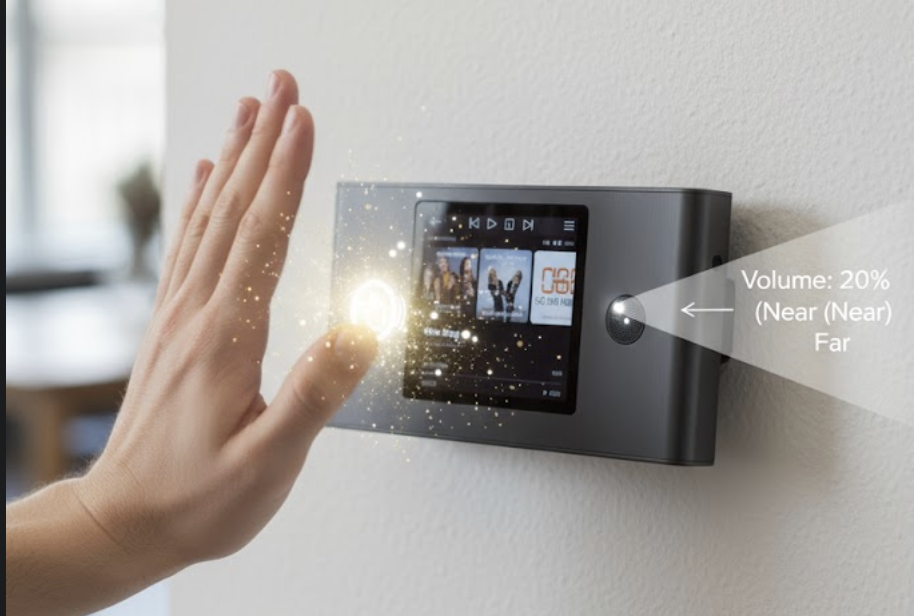

3. Smart Lock: This is an electronic door lock system where a rotary encoder, capacitve touch buttons and a joystick is used to set a password, and a button confirms the code, triggering a servo motor to lock or unlock the door.
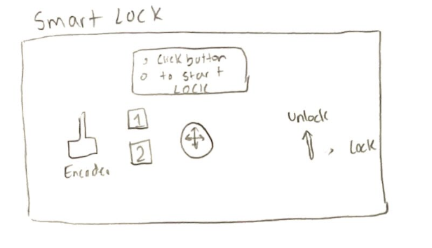
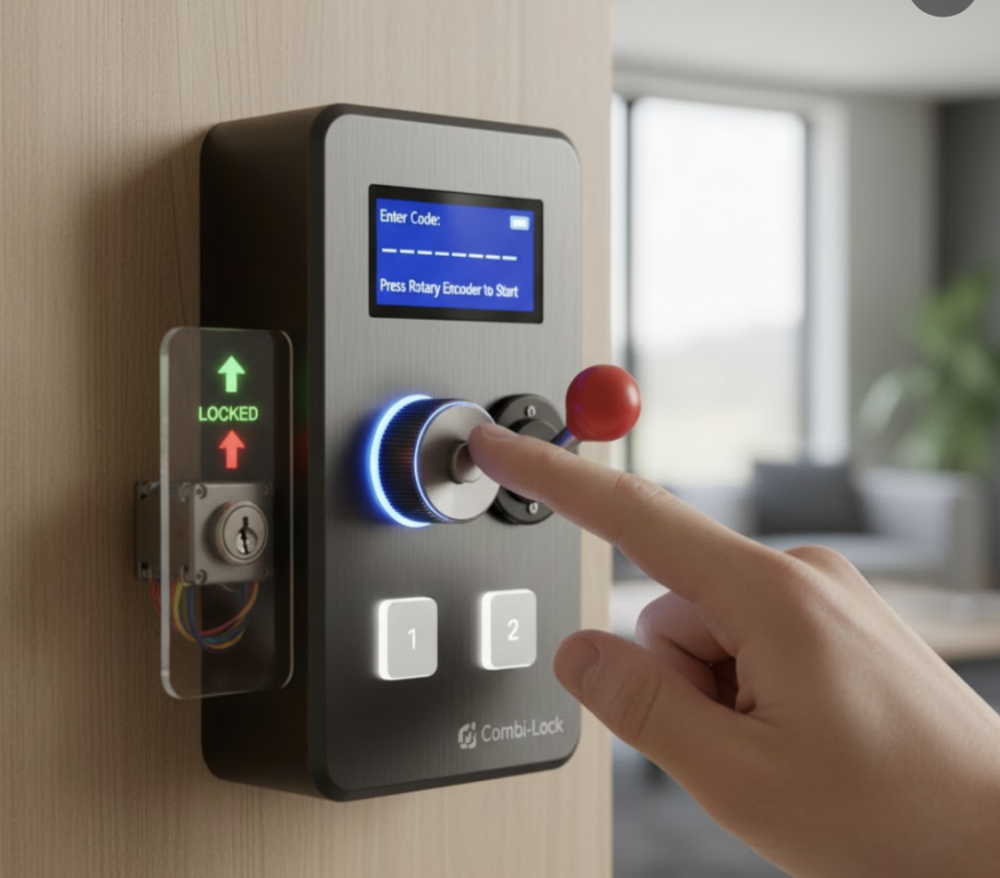

4. Motion & Sound Painter: This is an interactive art tool where a gesture sensor detects hand movements in space to draw lines on a screen, and a sound detector adds interactive elements or color changes based on ambient noise.
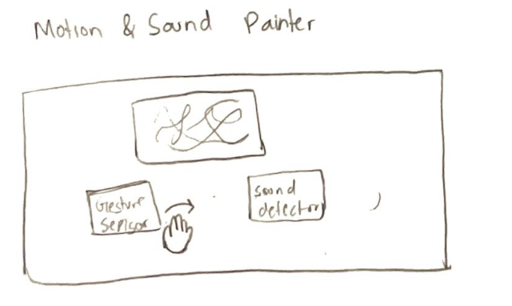
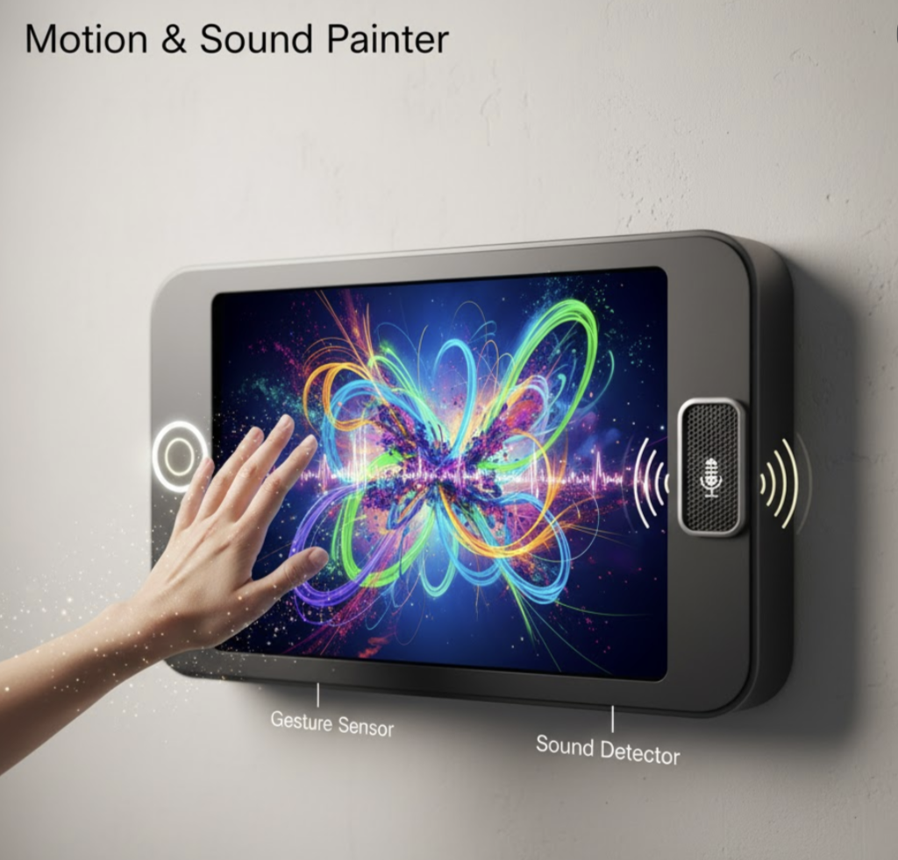

5. Proximity Alarm: This is a security system that uses a proximity sensor to detect an intruder, causing an alarm signal to activate and a servo motor to potentially trigger a physical deterrent (like a warning sign or small lock)
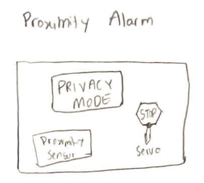
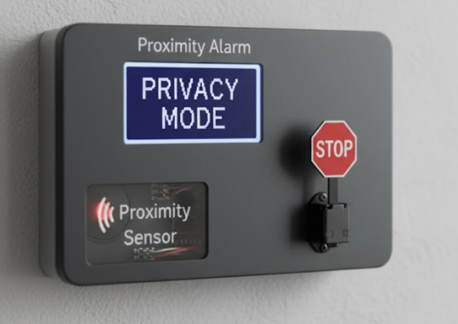

// Note : I used gemini to create pictures of my ideas. Sometime, the pictures were pretty accurate to how I imagine the device to look like in real life. However, most of the images were very "technical". 

**\*\*\*What are some things these sketches raise as questions? What do you need to physically prototype to understand how to anwer those questions?\*\*\***

I am questioning the shape of the devices. Most devices right now look rectangular and "boring". However, I think that some of these devices can be made to look more appealing and interactive. For example, the motion/sound painter can be more artistic in design. We can use a unique shape of a screen instead of the generic rectangular screen. 

**\*\*\*Pick one of these designs to prototype.\*\*\***

I am choosing the snake-game to prototype. It is one my core memories from my childhood. I think that the simple deisgn of the screen, encoder and joystick suits this device. 


### Part D
### Physical considerations for displaying information and housing parts
 
**\*\*\*Sketch 5 designs for how you would physically position your display and any buttons or knobs needed to interact with it.\*\*\***

The follwoing are the design sketches for the game:

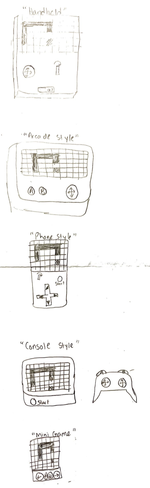

**\*\*\*What are some things these sketches raise as questions? What do you need to physically prototype to understand how to anwer those questions?\*\*\***

There are a few different things to consider while making the design for the snake game. 

1. Should it be a handheld device or not? Do we want it to be portable or not? 
2. Should the controller be separate than the screen?
3. How can the device be designed for better ergonomics?
4. Which design allows the user to interact with the game more?
5. What is the most comfortable design?

**\*\*\*Pick one of these display designs to integrate into your prototype.Explain the rationale for the design.\*\*\***

I am choosing the handheld design. The reason for this is becuase it is portable and easy to use. Users can play this game whereever they want. It will feel like you are holding a phone but becuase of the joystick and the rotary encoder, it will feel like a arcade game. It is the best of both worlds "Phone + arcade". 

Cardboard Prototype:
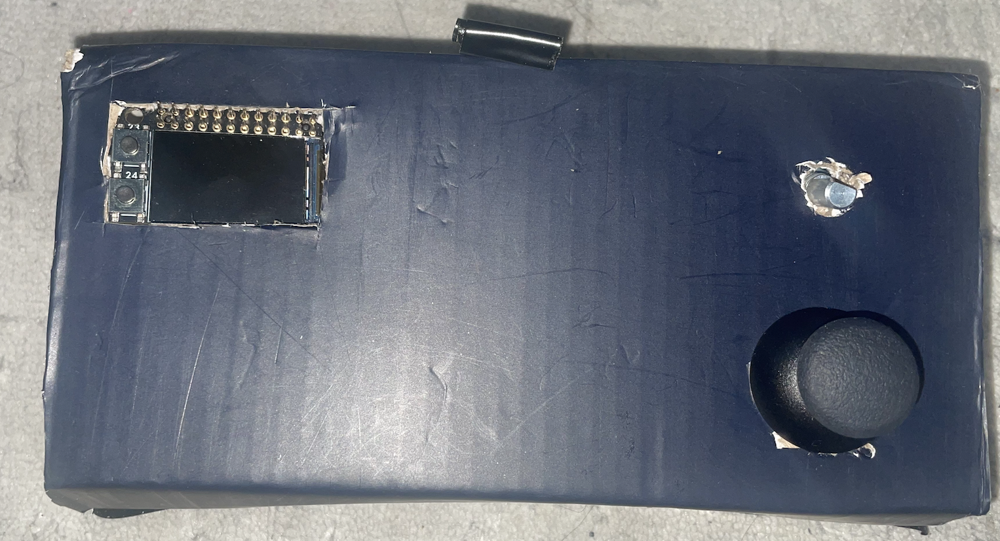


**\*\*\*Document your rough prototype.\*\*\***

 You can see the first rough prototype of the Snake Game below:

https://drive.google.com/file/d/14Ns12JMlTyB9NSIohsGHD1Rhj8-6Iu4j/view?usp=drive_link

# LAB PART 2

### Part 2
### Part E

#### Chaining Devices and Exploring Interaction Effects

My new version of the snake game can do the following:

There are different modes in which you can play the game. 
Mode 1: Classical method with joystick control
Mode 2: Encoder Control 
Mode 3: Controlling snake movements by physically tilting the game. 

The classical method has already been implemented in part 1. You can see the code for joystick control [here](snake_game.py)

After implementing the joystick control, I wanted to increases the level of difficulty by adding encoder control. You can see the code for encoder control [here](snake_game2.py)

Joystick and encoder control are pretty basic ways to pay a game. In order to add a unique mode, I wanted to be able to play the game by pysically titing the game. 

You can see the code for acceleramator control [here](snake_game3.py)

The three modes allows the user to interact with the game in various unique ways. Each level adds a new level of difficulty.

## Documenatation for Snake Game

**Hardware Components**
1. Raspberry Pi 5
2. Joystick Modules
3. Encoder
4. Acceleramator
5. QWIC connectors 
5. Cardboard 

**Software Components**

Pillow → (from PIL import Image, ImageDraw, ImageFont)

adafruit-blinka (enables CircuitPython libraries on Raspberry Pi)

adafruit-circuitpython-rgb-display → (import adafruit_rgb_display.st7789 as st7789)

adafruit-circuitpython-seesaw → (from adafruit_seesaw import seesaw, rotaryio, digitalio as seesaw_digitalio)

adafruit-circuitpython-lsm6ds → (import adafruit_lsm6ds.lsm6ds3 as lsm6ds)

sparkfun-qwiic-joystick → (import qwiic_joystick)

```
pip install pillow adafruit-blinka adafruit-circuitpython-rgb-display \
adafruit-circuitpython-seesaw adafruit-circuitpython-lsm6ds sparkfun-qwiic-joystick
```

***Brief explanation about Code***
**Core Functions**
Input Handling:
- get_joystick_direction() – Reads analog joystick values and converts them into movement directions.
- get_encoder_direction() – Maps encoder rotation to clockwise/counterclockwise direction changes.
- get_accelerometer_direction() – Translates device tilt into up/down/left/right motion.

Graphics:
- draw_cell() and draw_text() – Render grid cells and text onto the display.
- draw_game() – Updates the display each frame to show the snake, food, and score bar.

Game Flow:
- countdown() – Displays a 3–2–1–GO sequence before gameplay starts.
- game_loop() – Core loop that handles movement, collisions, and scoring.
- accelerometer_tutorial() – Teaches users how to control the snake using tilt before Level 3 starts.

**How the game works**
1. The game starts with a menu interface navigated using the encoder.
2. The player selects a control mode (Level 1–3).
3. Once started, the snake moves in real time, controlled by the chosen input device.
4. The player earns points by eating red food squares.
5. The game ends upon collision with the wall or self, showing the final score.
6. The user can pause or quit using the encoder button.

**How does the physical arrangement of devices (e.g., where the encoder or sensor is placed) change the user experience?**

Screen (MiniPiTFT) Placement
- The display should be positioned near the center or the top third of the handheld device.
- This placement aligns the visual information (the game) with the user's natural line of sight. Placing the screen at the bottom would require the user to angle their head or hands uncomfortably downward, creating a poor ergonomic experience and making it difficult to monitor the entire playing field quickly.

Joystick (Level 1) Placement
- The joystick should be placed on the lower right side of the device.
- This position optimizes for the dominant hand's thumb, which is the primary digit used for analog direction control in handheld gaming. Placing it near the area where the user naturally grips the device ensures that the thumb can easily and precisely manipulate the joystick without straining the hand or losing grip.

Rotary Encoder (Menu Navigation & Level 2 Control) Placement
- The encoder needs to be accessible for both quick menu turns and continuous game control. A comfortable position is typically on the upper edge or corner, away from the primary grip and thumb controls.
-The encoder requires a two-finger pinch grip (thumb and index finger) for precise rotation. Placing it on the side or top edge allows the user to operate it easily using the non-dominant hand or index finger without interfering with the main gameplay controls (the joystick) or obstructing the screen.

Note: Due to the size of the raspberry pi 5, I had to place the encoder to the right side of teh joystick. However, if I use a smaller microcontroller, the above is how I would place the encoder.

Accelerometer (Level 3) Arrangement
- The accelerometer (LSM6DS3) must be integrated internally and hidden from the user.
- Unlike physical controls, the accelerometer is a passive input device; its function relies on the movement of the entire chassis, not its individual location. The user doesn't need to know where it is, only that tilting the device moves the snake. Hiding it maintains a clean aesthetic and prevents the user from accidentally touching or damaging the sensitive component. Furthermore, its internal orientation must be correctly aligned with the expected axes of motion (i.e., forward tilt must map to the snake's UP/DOWN movement, which required flipping the Y-axis in the code).

**How does the device feel like**

The device is lightweight and comfortable to hold. It is in the shape of a square . The user can see three main components ( Screen, Joystick and Encoder).

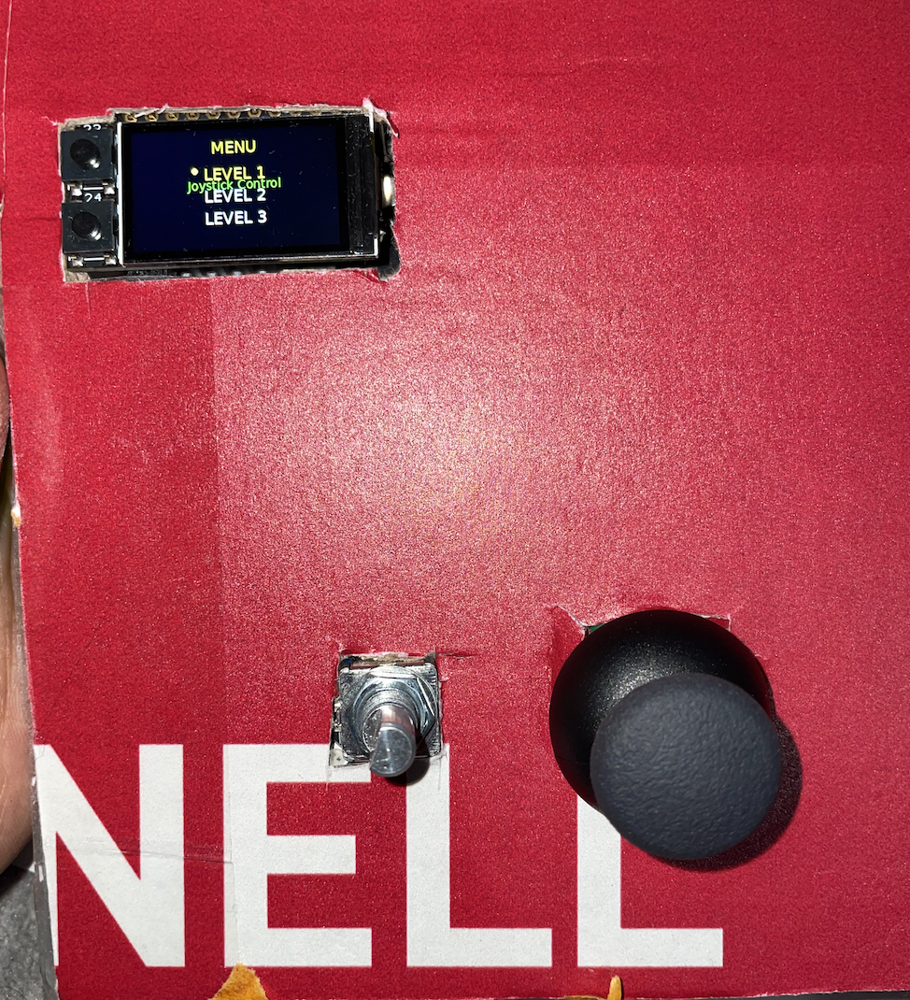
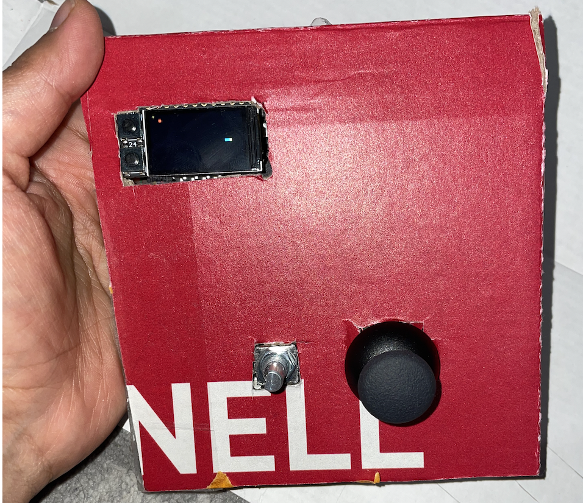


**How are teh components connected**
All the components are connected by using QWIC connectors.

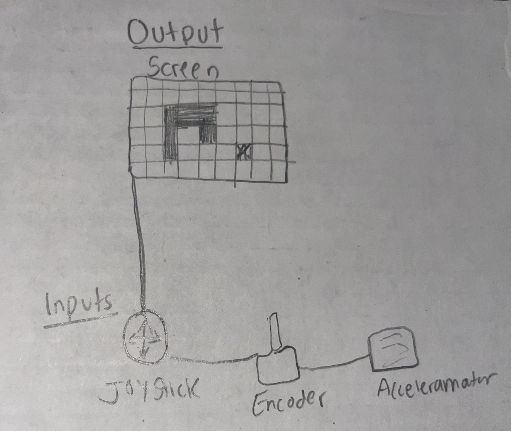

### Part F Recording 

You can see the recording at the following link:

https://drive.google.com/file/d/1-T83G7m3g3fVwwnMUKkWo-IC1VT1_nC1/view?usp=drive_link


**Written reflection: What did you learn about multi-input/multi-output interaction? What was fun, surprising, or challenging?**

Building this game taught me that the biggest challenge in multi-control design is making sure all the different inputs—the joystick, the encoder, and tilting the whole device—can speak the same simple language to the snake. 
The trickiest part was getting the tilt control to feel intuitive. I tested this game with 2 users. The users were able to use the joystick and encoder pretty well. However, the users found the tilting level to be difficult. They were unsure about how much they had to tilt to a side for it to work. So, taking this in to consideration, I added a "tutorial" section that allows the user to practice the tilting before the game starts. 
Overall, the experience was very enjoyable. 

