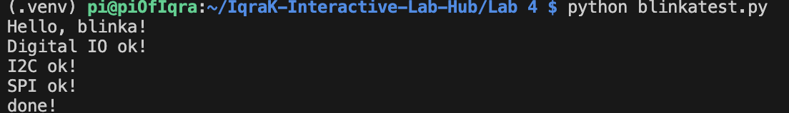
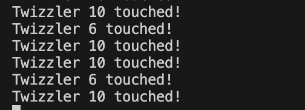
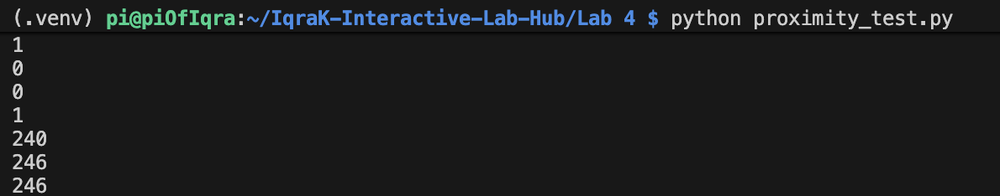
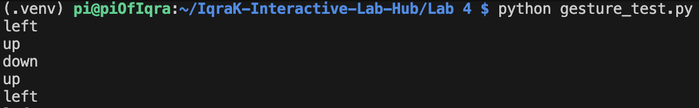
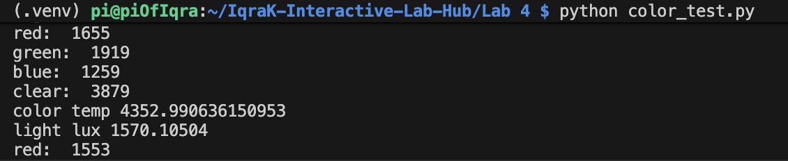
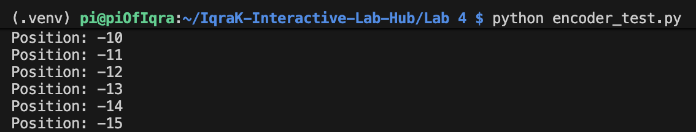
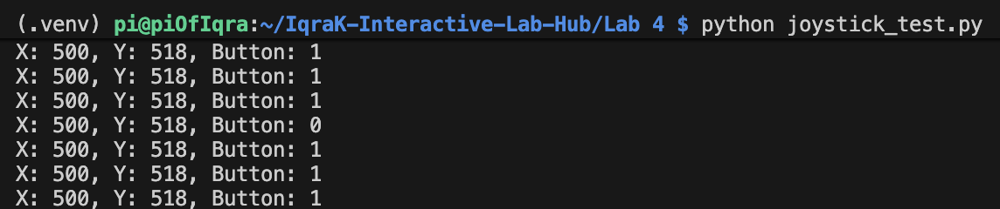
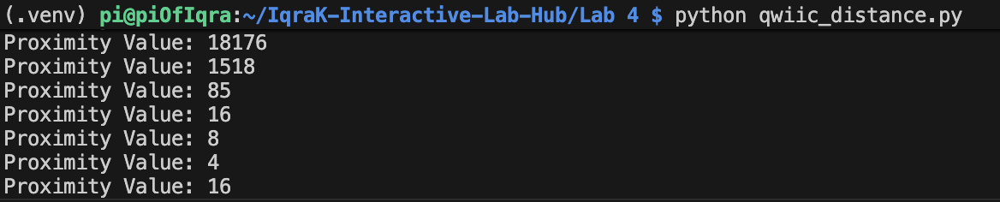
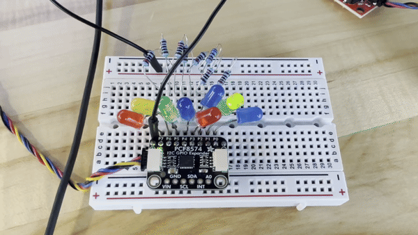

# Ph-UI!!!

<details>
	<summary><strong>Instructions for Students (Click to Expand)</strong></summary>
  
	**Submission Cleanup Reminder:**
	- This README.md contains extra instructional text for guidance.
	- Before submitting, remove all instructional text and example prompts from this file.
	- You may delete these sections or use the toggle/hide feature in VS Code to collapse them for a cleaner look.
	- Your final submission should be neat, focused on your own work, and easy to read for grading.
  
	This helps ensure your README.md is clear, professional, and uniquely yours!
</details>

---

## Lab 4 Deliverables

### Part 1 (Week 1)
**Submit the following for Part 1:**  
*️⃣ **A. Capacitive Sensing**
	- Photos/videos of your Twizzler (or other object) capacitive sensor setup
	- Code and terminal output showing touch detection

*️⃣ **B. More Sensors**
	- Photos/videos of each sensor tested (light/proximity, rotary encoder, joystick, distance sensor)
	- Code and terminal output for each sensor

*️⃣ **C. Physical Sensing Design**
	- 5 sketches of different ways to use your chosen sensor
	- Written reflection: questions raised, what to prototype
	- Pick one design to prototype and explain why

*️⃣ **D. Display & Housing**
	- 5 sketches for display/button/knob positioning
	- Written reflection: questions raised, what to prototype
	- Pick one display design to integrate
	- Rationale for design
	- Photos/videos of your cardboard prototype

---

### Part 2 (Week 2)
**Submit the following for Part 2:**  
*️⃣ **E. Multi-Device Demo**
	- Code and video for your multi-input multi-output demo (e.g., chaining Qwiic buttons, servo, GPIO expander, etc.)
	- Reflection on interaction effects and chaining

*️⃣ **F. Final Documentation**
	- Photos/videos of your final prototype
	- Written summary: what it looks like, works like, acts like
	- Reflection on what you learned and next steps

---

## Lab Overview

## Part 1 Lab Preparation

### Gathering materials for this lab:

* Cardboard (start collecting those shipping boxes!)
* Found objects and materials--like bananas and twigs.
* Cutting board
* Cutting tools
* Markers

## Deliverables \& Submission for Lab 4

The deliverables for this lab are, writings, sketches, photos, and videos that show what your prototype:
* "Looks like": shows how the device should look, feel, sit, weigh, etc.
* "Works like": shows what the device can do.
* "Acts like": shows how a person would interact with the device.

For submission, the readme.md page for this lab should be edited to include the work you have done:
* Upload any materials that explain what you did, into your lab 4 repository, and link them in your lab 4 readme.md.
* Link your Lab 4 readme.md in your main Interactive-Lab-Hub readme.md. 
* Labs are due on Mondays, make sure to submit your Lab 4 readme.md to Canvas.


## Lab Overview

A) [Capacitive Sensing](#part-a)

B) [OLED screen](#part-b) 

C) [Paper Display](#part-c)

D) [Materiality](#part-d)

E) [Servo Control](#part-e)

F) [Record the interaction](#part-f)


3. Check CircuitPython Blinka installation:**
	```bash
	python blinkatest.py
	```
	If you see "Hello blinka!", your setup is correct. If not, follow the troubleshooting steps in the file or ask for help.



### Part A
### Capacitive Sensing, a.k.a. Human-Twizzler Interaction 

<p float="left">

 
</p>

Plug in the capacitive sensor board with the QWIIC connector. Connect your Twizzlers with either the copper tape or the alligator clips (the clips work better). Install the latest requirements from your working virtual environment:

These Twizzlers are connected to pads 6 and 10. When you run the code and touch a Twizzler, the terminal will print out the following

```
(circuitpython) pi@ixe00:~/Interactive-Lab-Hub/Lab 4 $ python cap_test.py 
Twizzler 10 touched!
Twizzler 6 touched!
```



### Part B
### More sensors

#### Light/Proximity/Gesture sensor (APDS-9960)
It is capable of sensing proximity, light (also RGB), and gesture! 
 

 





#### Rotary Encoder 

A rotary encoder is an electro-mechanical device that converts the angular position to analog or digital output signals. 

```
(circuitpython) pi@ixe00:~/Interactive-Lab-Hub/Lab 4 $ python encoder_test.py
```



#### Joystick 


A [joystick](https://www.sparkfun.com/products/15168) can be used to sense and report the input of the stick for it pivoting angle or direction. It also comes with a button input!

<p float="left">

</p>



#### Distance Sensor


Earlier we have asked you to play with the proximity sensor, which is able to sense objects within a short distance. Here, we offer [Sparkfun Proximity Sensor Breakout](https://www.sparkfun.com/products/15177), With the ability to detect objects up to 20cm away.

<p float="left">




### Part C
### Physical considerations for sensing

Usually, sensors need to be positioned in specific locations or orientations to make them useful for their application. Now that you've tried a bunch of the sensors, pick one that you would like to use, and an application where you use the output of that sensor for an interaction. For example, you can use a distance sensor to measure someone's height if you position it overhead and get them to stand under it.


**\*\*\*Draw 5 sketches of different ways you might use your sensor, and how the larger device needs to be shaped in order to make the sensor useful.\*\*\***

**\*\*\*What are some things these sketches raise as questions? What do you need to physically prototype to understand how to anwer those questions?\*\*\***

**\*\*\*Pick one of these designs to prototype.\*\*\***


### Part D
### Physical considerations for displaying information and housing parts


Here is a Pi with a paper faceplate on it to turn it into a display interface:


This is fine, but the mounting of the display constrains the display location and orientation a lot. Also, it really only works for applications where people can come and stand over the Pi, or where you can mount the Pi to the wall.

Here is another prototype for a paper display:


Your kit includes these [SparkFun Qwiic OLED screens](https://www.sparkfun.com/products/17153). These use less power than the MiniTFTs you have mounted on the GPIO pins of the Pi, but, more importantly, they can be more flexibly mounted elsewhere on your physical interface. The way you program this display is almost identical to the way you program a  Pi display. Take a look at `oled_test.py` and some more of the [Adafruit examples](https://github.com/adafruit/Adafruit_CircuitPython_SSD1306/tree/master/examples).

<p float="left">


</p>


It holds a Pi and usb power supply, and provides a front stage on which to put writing, graphics, LEDs, buttons or displays.

This design can be made by scoring a long strip of corrugated cardboard of width X, with the following measurements:

| Y height of box <br> <sub><sup>- thickness of cardboard</sup></sub> | Z  depth of box <br><sub><sup>- thickness of cardboard</sup></sub> | Y height of box  | Z  depth of box | H height of faceplate <br><sub><sup>* * * * * (don't make this too short) * * * * *</sup></sub>|
| --- | --- | --- | --- | --- | 

Fold the first flap of the strip so that it sits flush against the back of the face plate, and tape, velcro or hot glue it in place. This will make a H x X interface, with a box of Z x X footprint (which you can adapt to the things you want to put in the box) and a height Y in the back. 

Here is an example:


Think about how you want to present the information about what your sensor is sensing! Design a paper display for your project that communicates the state of the Pi and a sensor. Ideally you should design it so that you can slide the Pi out to work on the circuit or programming, and then slide it back in and reattach a few wires to be back in operation.
 
**\*\*\*Sketch 5 designs for how you would physically position your display and any buttons or knobs needed to interact with it.\*\*\***

**\*\*\*What are some things these sketches raise as questions? What do you need to physically prototype to understand how to anwer those questions?\*\*\***

**\*\*\*Pick one of these display designs to integrate into your prototype.\*\*\***

**\*\*\*Explain the rationale for the design.\*\*\*** (e.g. Does it need to be a certain size or form or need to be able to be seen from a certain distance?)

Build a cardboard prototype of your design.


**\*\*\*Document your rough prototype.\*\*\***


# LAB PART 2

### Part 2

Following exploration and reflection from Part 1, complete the "looks like," "works like" and "acts like" prototypes for your design, reiterated below.


### Part E

#### Chaining Devices and Exploring Interaction Effects

For Part 2, you will design and build a fun interactive prototype using multiple inputs and outputs. This means chaining Qwiic and STEMMA QT devices (e.g., buttons, encoders, sensors, servos, displays) and/or combining with traditional breadboard prototyping (e.g., LEDs, buzzers, etc.).

**Your prototype should:**
- Combine at least two different types of input and output devices, inspired by your physical considerations from Part 1.
- Be playful, creative, and demonstrate multi-input/multi-output interaction.

**Document your system with:**
- Code for your multi-device demo
- Photos and/or video of the working prototype in action
- A simple interaction diagram or sketch showing how inputs and outputs are connected and interact
- Written reflection: What did you learn about multi-input/multi-output interaction? What was fun, surprising, or challenging?

**Questions to consider:**
- What new types of interaction become possible when you combine two or more sensors or actuators?
- How does the physical arrangement of devices (e.g., where the encoder or sensor is placed) change the user experience?
- What happens if you use one device to control or modulate another (e.g., encoder sets a threshold, sensor triggers an action)?
- How does the system feel if you swap which device is "primary" and which is "secondary"?

Try chaining different combinations and document what you discover!

See encoder_accel_servo_dashboard.py in the Lab 4 folder for an example of chaining together three devices.

**`Lab 4/encoder_accel_servo_dashboard.py`**

#### Using Multiple Qwiic Buttons: Changing I2C Address (Physically & Digitally)

If you want to use more than one Qwiic Button in your project, you must give each button a unique I2C address. There are two ways to do this:

##### 1. Physically: Soldering Address Jumpers

On the back of the Qwiic Button, you'll find four solder jumpers labeled A0, A1, A2, and A3. By bridging these with solder, you change the I2C address. Only one button on the chain can use the default address (0x6F).

**Address Table:**

| A3 | A2 | A1 | A0 | Address (hex) |
|----|----|----|----|---------------|
|  0 |  0 |  0 |  0 |    0x6F       |
|  0 |  0 |  0 |  1 |    0x6E       |
|  0 |  0 |  1 |  0 |    0x6D       |
|  0 |  0 |  1 |  1 |    0x6C       |
|  0 |  1 |  0 |  0 |    0x6B       |
|  0 |  1 |  0 |  1 |    0x6A       |
|  0 |  1 |  1 |  0 |    0x69       |
|  0 |  1 |  1 |  1 |    0x68       |
|  1 |  0 |  0 |  0 |    0x67       |
| ...| ...| ...| ... |     ...      |

For example, if you solder A0 closed (leave A1, A2, A3 open), the address becomes 0x6E.

**Soldering Tips:**
- Use a small amount of solder to bridge the pads for the jumper you want to close.
- Only one jumper needs to be closed for each address change (see table above).
- Power cycle the button after changing the jumper.

##### 2. Digitally: Using Software to Change Address

You can also change the address in software (temporarily or permanently) using the example script `qwiic_button_ex6_changeI2CAddress.py` in the Lab 4 folder. This is useful if you want to reassign addresses without soldering.

Run the script and follow the prompts:
```bash
python qwiic_button_ex6_changeI2CAddress.py
```
Enter the new address (e.g., 5B for 0x5B) when prompted. Power cycle the button after changing the address.

**Note:** The software method is less foolproof and you need to make sure to keep track of which button has which address!


##### Using Multiple Buttons in Code

After setting unique addresses, you can use multiple buttons in your script. See these example scripts in the Lab 4 folder:

- **`qwiic_1_button.py`**: Basic example for reading a single Qwiic Button (default address 0x6F). Run with:
	```bash
	python qwiic_1_button.py
	```

- **`qwiic_button_led_demo.py`**: Demonstrates using two Qwiic Buttons at different addresses (e.g., 0x6F and 0x6E) and controlling their LEDs. Button 1 toggles its own LED; Button 2 toggles both LEDs. Run with:
	```bash
	python qwiic_button_led_demo.py
	```

Here is a minimal code example for two buttons:
```python
import qwiic_button

# Default button (0x6F)
button1 = qwiic_button.QwiicButton()
# Button with A0 soldered (0x6E)
button2 = qwiic_button.QwiicButton(0x6E)

button1.begin()
button2.begin()

while True:
		if button1.is_button_pressed():
				print("Button 1 pressed!")
		if button2.is_button_pressed():
				print("Button 2 pressed!")
```

For more details, see the [Qwiic Button Hookup Guide](https://learn.sparkfun.com/tutorials/qwiic-button-hookup-guide/all#i2c-address).

---

### PCF8574 GPIO Expander: Add More Pins Over I²C

Sometimes your Pi’s header GPIO pins are already full (e.g., with a display or HAT). That’s where an I²C GPIO expander comes in handy.

We use the Adafruit PCF8574 I²C GPIO Expander, which gives you 8 extra digital pins over I²C. It’s a great way to prototype with LEDs, buttons, or other components on the breadboard without worrying about pin conflicts—similar to how Arduino users often expand their pinouts when prototyping physical interactions.

**Why is this useful?**
- You only need two wires (I²C: SDA + SCL) to unlock 8 extra GPIOs.
- It integrates smoothly with CircuitPython and Blinka.
- It allows a clean prototyping workflow when the Pi’s 40-pin header is already occupied by displays, HATs, or sensors.
- Makes breadboard setups feel more like an Arduino-style prototyping environment where it’s easy to wire up interaction elements.

**Demo Script:** `Lab 4/gpio_expander.py`

<p align="center">
    
</p>

We connected 8 LEDs (through 220 Ω resistors) to the expander and ran a little light show. The script cycles through three patterns:
- Chase (one LED at a time, left to right)
- Knight Rider (back-and-forth sweep)
- Disco (random blink chaos)

Every few runs, the script swaps to the next pattern automatically:
```bash
python gpio_expander.py
```

This is a playful way to visualize how the expander works, but the same technique applies if you wanted to prototype buttons, switches, or other interaction elements. It’s a lightweight, flexible addition to your prototyping toolkit.

---

### Servo Control with SparkFun Servo pHAT
For this lab, you will use the **SparkFun Servo pHAT** to control a micro servo (such as the Miuzei MS18 or similar 9g servo). The Servo pHAT stacks directly on top of the Adafruit Mini PiTFT (135×240) display without pin conflicts:
- The Mini PiTFT uses SPI (GPIO22, 23, 24, 25) for display and buttons ([SPI pinout](https://pinout.xyz/pinout/spi)).
- The Servo pHAT uses I²C (GPIO2 & 3) for the PCA9685 servo driver ([I2C pinout](https://pinout.xyz/pinout/i2c)).
- Since SPI and I²C are separate buses, you can use both boards together.
**⚡ Power:**
- Plug a USB-C cable into the Servo pHAT to provide enough current for the servos. The Pi itself should still be powered by its own USB-C supply. Do NOT power servos from the Pi’s 5V rail.

<p align="center">
    
</p>

**Basic Python Example:**
We provide a simple example script: `Lab 4/pi_servo_hat_test.py` (requires the `pi_servo_hat` Python package).
Run the example:
```
python pi_servo_hat_test.py
```
For more details and advanced usage, see the [official SparkFun Servo pHAT documentation](https://learn.sparkfun.com/tutorials/pi-servo-phat-v2-hookup-guide/all#resources-and-going-further).
A servo motor is a rotary actuator that allows for precise control of angular position. The position is set by the width of an electrical pulse (PWM). You can read [this Adafruit guide](https://learn.adafruit.com/adafruit-arduino-lesson-14-servo-motors/servo-motors) to learn more about how servos work.

---


### Part F

### Record

Document all the prototypes and iterations you have designed and worked on! Again, deliverables for this lab are writings, sketches, photos, and videos that show what your prototype:
* "Looks like": shows how the device should look, feel, sit, weigh, etc.
* "Works like": shows what the device can do
* "Acts like": shows how a person would interact with the device

