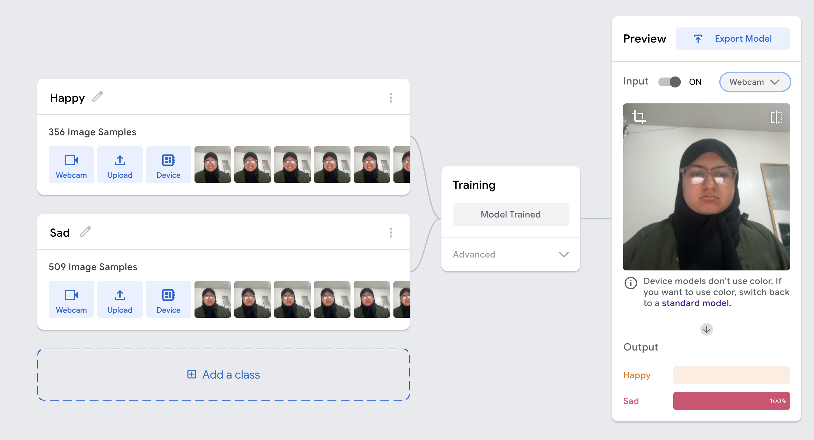
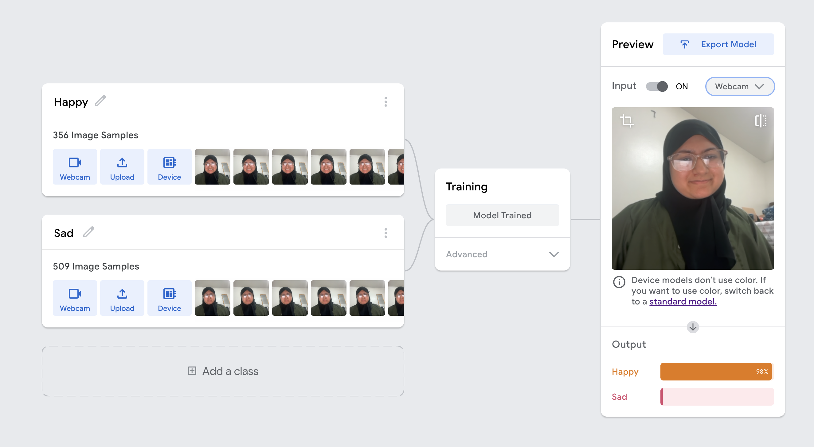

# Observant Systems
For lab this week, we focus on creating interactive systems that can detect and respond to events or stimuli in the environment of the Pi, like the Boat Detector we mentioned in lecture. 
Your **observant device** could, for example, count items, find objects, recognize an event or continuously monitor a room.

This lab will help you think through the design of observant systems, particularly corner cases that the algorithms need to be aware of.

### For the lab, you will need:
1. Pull the new Github Repo
1. Raspberry Pi
1. Webcam 

### Deliverables for this lab are:
1. Show pictures, videos of the "sense-making" algorithms you tried.
1. Show a video of how you embed one of these algorithms into your observant system.
1. Test, characterize your interactive device. Show faults in the detection and how the system handled it.

## Overview
Building upon the paper-airplane metaphor (we're understanding the material of machine learning for design), here are the four sections of the lab activity:

A) [Play](#part-a)

B) [Fold](#part-b)

C) [Flight test](#part-c)

D) [Reflect](#part-d)

---

### Part A
### Play with different sense-making algorithms.

#### Pytorch for object recognition

```
python infer.py
```
 
A coffe cup was placed in front of the camera. The above script was able to predict that this was a "coffepot", which is pretty close to coffee cup.

.png>)


### Machine Vision With Other Tools
The following sections describe tools ([MediaPipe](#mediapipe) and [Teachable Machines](#teachable-machines)).

#### MediaPipe

A established open source and efficient method of extracting information from video streams comes out of Google's [MediaPipe](https://mediapipe.dev/), which offers state of the art face, face mesh, hand pose, and body pose detection.


To get started, install dependencies into a virtual environment for this exercise as described in [prep.md](prep.md):

Each of the installs will take a while, please be patient. After successfully installing mediapipe, connect your webcam to your Pi and use **VNC to access to your Pi**, open the terminal, and go to Lab 5 folder and run the hand pose detection script we provide:
(***it will not work if you use ssh from your laptop***)


```
(venv-ml) pi@ixe00:~ $ cd Interactive-Lab-Hub/Lab\ 5
(venv-ml) pi@ixe00:~ Interactive-Lab-Hub/Lab 5 $ python hand_pose.py
```

See the video below for the demonstration of Quiet Coyote

https://drive.google.com/file/d/1LPtlO-JxWKBNUXMRwhvquFnVlcm1vG_j/view?usp=sharing

#### Moondream Vision-Language Model

[Moondream](https://www.ollama.com/library/moondream) is a lightweight vision-language model that can understand and answer questions about images. Unlike the classification models above, Moondream can describe images in natural language and answer specific questions about what it sees.

The camera captured a photo of me sitting in my room.
It was able to detect a lot of things from the image ( clothes, glasses, expressions, setting , location.

)

#### Teachable Machines
Google's [TeachableMachines](https://teachablemachine.withgoogle.com/train) is very useful for prototyping with the capabilities of machine learning. We are using [a python package](https://github.com/MeqdadDev/teachable-machine-lite) with tensorflow lite to simplify the deployment process.

I created a simple teachable machine that can detect when I am drinking coffee. 


I could use this trained model to build a personal activity detector that automatically logs coffee breaks during work, triggers an alert or IoT action (such as turning on a kettle reminder light) when a cup is detected, and combines with time-tracking tools to analyze productivity patterns related to breaks. This method can also be adapted to detect other everyday activities or specific objects without writing complex computer vision code. Compared to OpenCV or MediaPipe, Teachable Machine is much more beginner-friendly, requires no coding, and allows quick customization with personal image data directly in the browser. While OpenCV and MediaPipe offer greater precision, flexibility, and control for production-level systems, Teachable Machine provides an intuitive, no-code environment for rapid prototyping and experimentation, making it ideal for simple, personalized projects like detecting when I’m drinking coffee.

### Part B
### Construct a simple interaction.

**\*\*\*Describe and detail the interaction, as well as your experimentation here.\*\*\***

For my interaction, I created a Teachable Machine emotion classifier that can recognize whether I appear happy or sad. Using my webcam, I trained the model with multiple examples of my face in both expressions.




### Part C
### Test the interaction prototype

Now flight test your interactive prototype and **note down your observations**:
For example:
1. When does it what it is supposed to do?
The emotion classifier works correctly when I sit in front of the camera in a similar lighting and background as during training. In these conditions, the live video feed clearly displays the correct label — “Happy” or “Sad” — on the screen in real time. When I smile or make a frown, the model updates almost instantly, showing the correct expression with high confidence.

1. When does it fail?
The classifier sometimes fails when the lighting changes, such as when the room becomes darker or when light hits my face from a different direction. It also struggles when my head is turned, when I move too close or too far from the camera, or when my expression is neutral or subtle. In those cases, the prediction may flicker between “Happy” and “Sad,” or show the wrong label entirely.

1. When it fails, why does it fail?
The main reason for failure is that the model was trained in a single setting with limited examples. Since it learned only from images taken under the same lighting, angle, and expression intensity, it doesn’t generalize well to new visual conditions. The classifier relies heavily on pixel patterns, so even small changes in brightness, background, or face position can confuse it.

1. Based on the behavior you have seen, what other scenarios could cause problems?
Fast head movements or talking could distort facial expressions, making the model misclassify them. Over time, slight delays or fluctuating predictions could make the on-screen feedback distracting. These problems could be reduced by training with more varied data, adding a “neutral” class, or averaging predictions over several frames for smoother output.

**\*\*\*Think about someone using the system. Describe how you think this will work.\*\*\***
1. Are they aware of the uncertainties in the system?
A user might not be fully aware of the system’s uncertainties at first. For example, they may assume the classifier will always correctly read their emotion, even though lighting, camera angle, or wearing glasses can change how the model interprets their face. Over time, however, users may notice that the system reacts inconsistently when they adjust their glasses or move slightly, making them realize the classifier’s sensitivity to visual changes.

1. How bad would they be impacted by a miss classification?
In this project, the impact of misclassification is low since the output is just an on-screen label. It might show “Sad” when the person is actually happy, which is only mildly confusing or amusing. However, in a real-world scenario — such as emotion-based feedback systems or educational tools — consistent misclassification could lead to frustration or loss of trust in the technology.

1. How could change your interactive system to address this?
To reduce these uncertainties, I could retrain the model using more diverse images, including ones where I wear glasses, remove them, or change lighting conditions. Adding a “neutral” expression class could help the system better handle in-between expressions. Another improvement would be to smooth the predictions over several frames so that a single misread frame doesn’t immediately flip the displayed emotion.

1. Are there optimizations you can try to do on your sense-making algorithm.
Yes. I could:

Collect a larger and more varied training dataset (different lighting, angles, facial accessories).

Use data augmentation (rotation, brightness adjustments) to make the model more robust.

Implement temporal smoothing — averaging predictions across a few frames for more stable output.

Fine-tune the model’s confidence threshold, so it only displays a result when it’s more certain of the classification.

### Part D
### Characterize your own Observant system

Now that you have experimented with one or more of these sense-making systems **characterize their behavior**.
During the lecture, we mentioned questions to help characterize a material:
* What can you use X for?
* What is a good environment for X?
* What is a bad environment for X?
* When will X break?
* When it breaks how will X break?
* What are other properties/behaviors of X?
* How does X feel?

**\*\*\*Include a short video demonstrating the answers to these questions.\*\*\***

### Part 2.

Following exploration and reflection from Part 1, finish building your interactive system, and demonstrate it in use with a video.

**\*\*\*Include a short video demonstrating the finished result.\*\*\***
