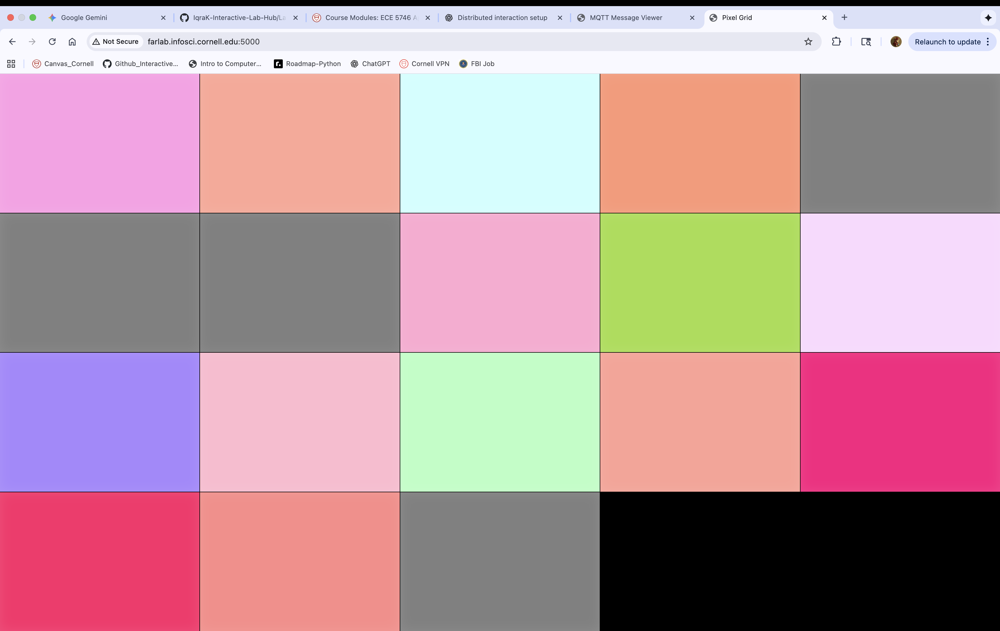
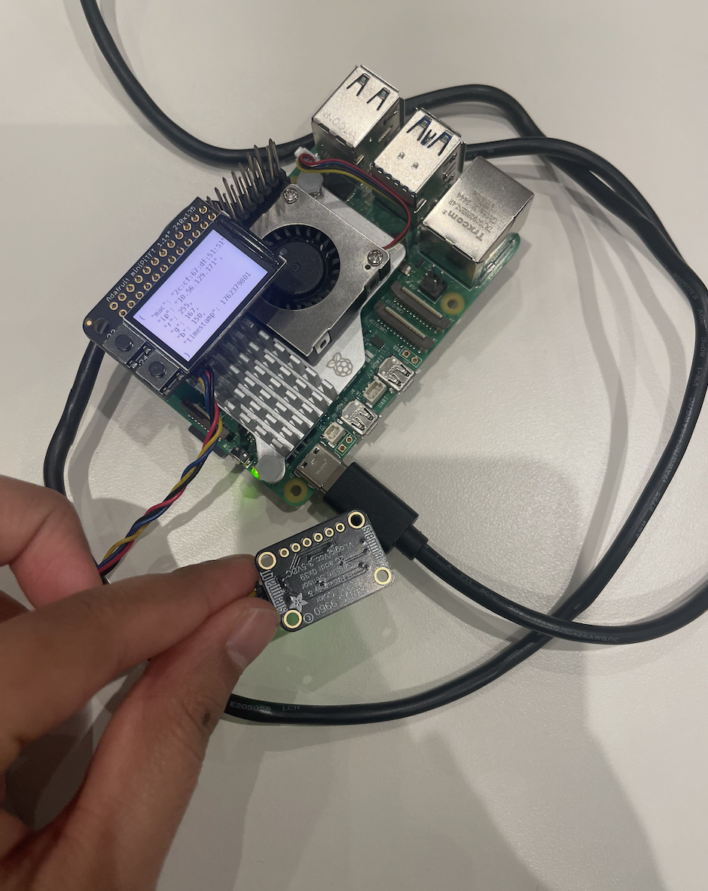
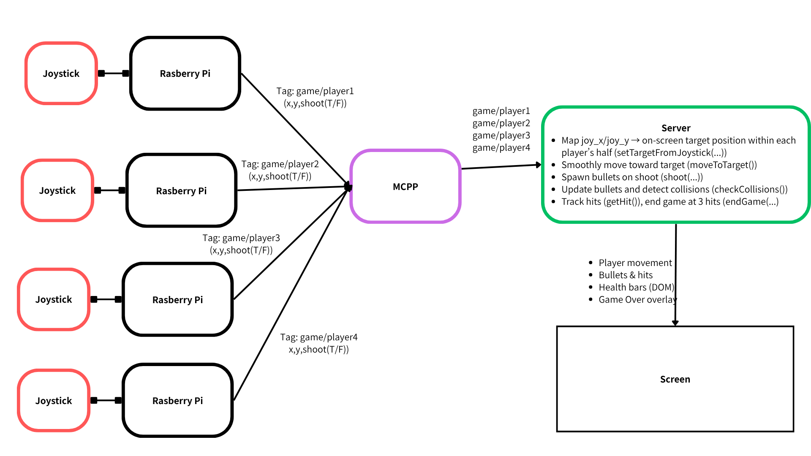

# Distributed Interaction

Iqra Khan, Celeste Bisch(lb854@cornell.edu), Nana Takada(nt388@cornell.edu) , Jaspreet Singh(jl4536@cornell.edu)

## Part B: Collaborative Pixel Grid

**📸 Include: Screenshot of grid + photo of your Pi setup**



---

### Deliverables

Replace this README with your documentation:

**1. Project Description**
-Our project is a shooting game where each Raspberry Pi is connected to a joystick. There are two teams—left and right—and multiple players can join either team. Each player starts with three lives; once a player is hit three times, they are eliminated. When all players on a team are eliminated, the game is over. Players can move freely within their team’s area.

Each Raspberry Pi has a unique label (e.g., game/player1) and transmits its tilt movements and shooting actions (based on joystick clicks) via MQTT. The server receives and processes each player’s movement and shooting data.

**2. Architecture Diagram**


**3. Build Documentation**

[Video Prototype](https://drive.google.com/file/d/1q2kW2iP4jFZXachqrEmqX1LXDZw4-zAk/view?usp=sharing)

[Video of Prototype with Joystick](https://drive.google.com/file/d/1gfdvAMW0J8bkEe9sS9Wu_g4WxeiCa-Uz/view?usp=sharing)

MQTT topics used: game/player1, game/player2, game/player3, game/player4

# Multiplayer Shooting Game

## 1. Project Description

Our project is a shooting game where each Raspberry Pi is connected to a joystick. There are two teams—left and right—and multiple players can join either team. Each player starts with three lives; once a player is hit three times, they are eliminated. When all players on a team are eliminated, the game is over. Players can move freely within their team's area.

Each Raspberry Pi has a unique label (e.g., `game/player1`) and transmits its tilt movements and shooting actions (based on joystick clicks) via MQTT. The server receives and processes each player's movement and shooting data.

## 2. Architecture Diagram


## 3. Build Documentation

### Video Demos

- [Video Prototype](https://drive.google.com/file/d/1q2kW2iP4jFZXachqrEmqX1LXDZw4-zAk/view?usp=sharing)
- [Video of Prototype with Joystick](https://drive.google.com/file/d/1gfdvAMW0J8bkEe9sS9Wu_g4WxeiCa-Uz/view?usp=sharing)

### MQTT Topics

- `game/player1`
- `game/player2`
- `game/player3`
- `game/player4`

### Setup

Get the canvas and 2D context:
```javascript
const ctx = canvas.getContext('2d');
```

Open a Socket.IO connection:
```javascript
const socket = io();
```

### Players

Four Player objects are created, two on each side:

- **Player 1** (Blue): Starts top-left
- **Player 2** (Red): Starts top-right
- **Player 3** (Green): Starts bottom-left
- **Player 4** (Yellow): Starts bottom-right

Each player has a target position and moves smoothly toward it in `moveToTarget()`.

### Joystick → Position

MQTT payload includes `joy_x`, `joy_y` in the `[-1, 1]` range. `setTargetFromJoystick(x, y)` maps these to screen coordinates:

- Players 1 & 3 are restricted to the left half of the screen
- Players 2 & 4 are restricted to the right half of the screen
- Values are clamped to the canvas bounds

### Shooting

When a payload has `shoot: true`, a Bullet is spawned:

- Players 1 & 3 (Left Side) shoot right (`direction = 1`)
- Players 2 & 4 (Right Side) shoot left (`direction = -1`)

### Collisions & Hits

Each frame, `checkCollisions()` checks if any active bullet `collidesWith()` a player.

- Players cannot hit themselves or teammates on the same side (e.g., Player 1 cannot hit Player 3)
- On a valid hit, `player.getHit()` increments hits
- After 3 hits, a player's `alive` status is set to `false`
- `checkWinner()` is called, and if only one player remains, the game ends

### Game Loop

`requestAnimationFrame(gameLoop)` updates positions, filters inactive bullets, checks collisions, and draws all players and bullets.

### Game Over / Restart

- `endGame(winnerPlayer)` shows an overlay with the winner
- `restartGame()` resets all players/bullets locally and emits `socket.emit('restart_game')` to notify the server (which resets the bot timers)

### Socket/Message Contract

**Server → Client** (via Socket.IO):

```javascript
socket.emit('mqtt_message', {
  topic: 'IDD/game/player1', // or player2, player3, player4
  payload: { joy_x: 0.4, joy_y: -0.2, shoot: false }
});

// Notifies client if a player is now AI-controlled
socket.emit('bot_status', {
  player: 'player1',
  active: true // true = bot active, false = human active
});
```

**Client → Server**:

```javascript
socket.emit('restart_game');
```

### Example MQTT Payloads

```json
{ "joy_x": -1.0, "joy_y": 0.6, "shoot": true }
```

Move target left/right with `joy_x`, up/down with `joy_y`. When `shoot` is `true`, a bullet spawns.

### Example mosquitto_pub Commands

```bash
# Player 1
mosquitto_pub -h farlab.infosci.cornell.edu -u idd -P 'device@theFarm' -t IDD/game/player1 -m '{"joy_x":0.3,"joy_y":0.6,"shoot":false}'

# Player 2
mosquitto_pub -h farlab.infosci.cornell.edu -u idd -P 'device@theFarm' -t IDD/game/player2 -m '{"joy_x":-0.1,"joy_y":-0.5,"shoot":true}'

# Player 3
mosquitto_pub -h farlab.infosci.cornell.edu -u idd -P 'device@theFarm' -t IDD/game/player3 -m '{"joy_x":0.9,"joy_y":-0.2,"shoot":false}'

# Player 4
mosquitto_pub -h farlab.infosci.cornell.edu -u idd -P 'device@theFarm' -t IDD/game/player4 -m '{"joy_x":-0.7,"joy_y":0.1,"shoot":false}'
```

## How to Run The Shooting Game

### Installation

Navigate to the game directory and set up the virtual environment:

```bash
cd game_final
python3 -m venv .venv
source .venv/bin/activate
pip install -r requirements.txt
```

### Running the Game

**Terminal 1 - Start the server:**

```bash
python game_server.py
```

**Terminals 2-5 - Start hardware joysticks** (one terminal for each player):

```bash
python joystick.py 1
python joystick.py 2
python joystick.py 3
python joystick.py 4
```

### Access the Game

Open your browser and navigate to:

**Game URL:** http://0.0.0.0:5002


**4. User Testing**
- **Test with 2+ people NOT on your team**
- Photos/video of use
- What did they think before trying?
- What surprised them?
- What would they change?

**5. Reflection**
- What worked well?
- Challenges with distributed interaction?
- How did sensor events work?
- What would you improve?

---

## Code Files

**Server files:**
**Pi files:**
**Web interface:**

---

## Debugging Tools

**MQTT Message Viewer:** `http://farlab.infosci.cornell.edu:5001`
- See all MQTT messages in real-time
- View topics and payloads
- Helpful for debugging your own projects

**Command line:**
```bash
# See all IDD messages
mosquitto_sub -h farlab.infosci.cornell.edu -p 1883 -t "IDD/#" -u idd -P "device@theFarm"
```

---

## Troubleshooting

**MQTT:** Broker `farlab.infosci.cornell.edu:1883`, user `idd`, pass `device@theFarm`

**Sensor:** Check `i2cdetect -y 1`, APDS-9960 at `0x39`

**Grid:** Verify server running, check MQTT in console, test with web controller

**Pi venv:** Make sure to activate: `source .venv/bin/activate`


---

## Submission Checklist

Before submitting:
- [ ] Delete prep/instructions above
- [ ] Add YOUR project documentation
- [ ] Include photos/videos/diagrams  
- [ ] Document user testing with non-team members
- [ ] Add reflection on learnings
- [ ] List team names at top

**Your README = story of what YOU built!**

---

Resources: [MQTT Guide](https://www.hivemq.com/mqtt-essentials/) | [Paho Python](https://www.eclipse.org/paho/index.php?page=clients/python/docs/index.php) | [Flask-SocketIO](https://flask-socketio.readthedocs.io/)


